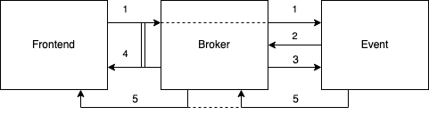

# Room entrance

1. An _agent_ sends a [room.enter](../api/room/enter.md) request.
2. Event service creates an [agent](../api/agent.md#agent) entry in the DB in `in_progress` status
   and sends `subscription.create` request to the broker[^1].
   This is being done in `endpoint::room::EnterHandler`.
3. The broker subscribes the _agent_ to the _room's_ _events_ topic specified in the request and
   sends a `subscription.create` broadcast event to the event service.
4. Also the broker send 202 response for the request (1) that the entrance process stared.
   So for the _agent_ all this scheme is a black box: it just sends a request and receives
   a response.
5. The event service handles the broadcast event (3), updates _agent_ status from (2) to `ready`
   and then sends a broadcast event to the _room's_ _events_ topic so other _agents_ could know
   that this _agent_ has come online. This _agent_ also receives this notification and this is
   the confirmation to it that it has really entered the room. The implementation of this step
   is in `endpoint::subscription::CreateHandler`.

[^1]: Currently it's being done through a unicast request to the _agent's_ inbox topic
      (in fact it's like sending a request to the agent). This is to route the request to that
      broker's node where the _agent_ is connected to. Broker nodes doesn't share their dynamic
      subscriptions state so only that node knows that the agent is connected to it.
